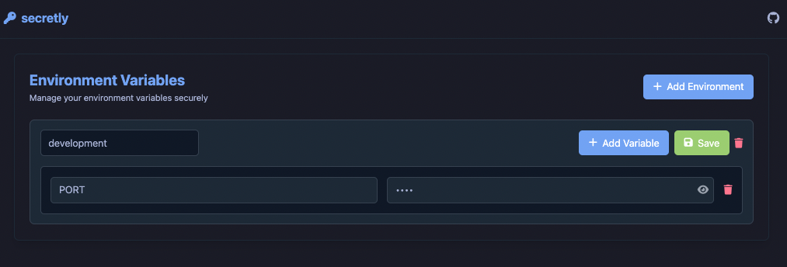

# Secretly

A modern web application for managing environment variables securely.



Secretly is a simple web service with an intuitive interface that helps you manage environment variables from a centralized location. It supports multiple environments and provides a REST API for runtime access to your environment variables. Use this as an internal service to securely manage and retrieve your environment configuration.

## Quick Start

The easiest way to run Secretly is using Docker:

```bash
docker run -d \
  --name secretly \
  -p 8080:8080 \
  -v $(pwd)/data:/app/data \
  rodrwan/secretly:latest
```

Then open your browser at [http://localhost:8080](http://localhost:8080)

### Using Docker Compose

```yaml
version: '3.8'
services:
  secretly:
    image: rodrwan/secretly:latest
    ports:
      - "8080:8080"
    volumes:
      - ./data:/app/data
```

Save as `docker-compose.yml` and run:
```bash
docker-compose up -d
```

## Configuration

The following environment variables can be configured:

- `PORT`: Port to run the server on (default: 8080)
- `ENV_PATH`: Path to the .env file (default: /app/data/.env)
- `BASE_PATH`: API base path (default: /api/v1)

Example with custom configuration:

```bash
docker run -d \
  --name secretly \
  -p 9000:9000 \
  -v $(pwd)/data:/app/data \
  -e PORT=9000 \
  -e BASE_PATH=/api/v1 \
  rodrwan/secretly:latest
```

## Development

If you want to contribute or run from source:

### Prerequisites

- Go 1.24 or later
- Docker and Docker Compose
- Make

### Quick Start

1. Clone the repository:
```bash
git clone https://github.com/rodrwan/secretly.git
cd secretly
```

2. Run with Make:
```bash
make help        # Show available commands
make dev         # Run locally
make docker-dev  # Run with Docker
```

### Manual Setup

1. Install dependencies:
```bash
go mod download
```

2. Generate template files:
```bash
make generate-templ
```

3. Run the application:
```bash
go run cmd/server/main.go
```

## Features

- Modern web interface for managing environment variables
- Secure storage of sensitive data
- RESTful API for programmatic access
- Docker support for easy deployment
- Dark theme optimized for developers

## API Endpoints

- `GET /api/v1/env`: Get all environment variables
- `POST /api/v1/env`: Update environment variables
- `GET /api/v1/env/{key}`: Get a specific environment variable

## Client Integration

### Installation

Add Secretly to your Go project:

```bash
go get github.com/rodrwan/secretly
```

### Usage

```go
package main

import (
    "fmt"
    "log"
    
    "github.com/rodrwan/secretly/pkg/secretly"
)

func main() {
    // Create a new client
    client := secretly.New(
        secretly.WithBaseURL("http://localhost:8080"),
        secretly.WithTimeout(5 * time.Second),
    )

    // Get all environment variables
    envs, err := client.GetAll()
	if err != nil {
		log.Fatalf("failed to get env: %v", err)
	}

	fmt.Println(envs)

    env, err := client.GetEnvironmentByName("development")
	if err != nil {
		log.Fatalf("failed to get env: %v", err)
	}

	fmt.Println(env)
}
```

### Client Configuration

The client can be configured with the following options:

```go
client := secretly.New(
    secretly.WithBaseURL("http://localhost:8080"),  // Set custom base URL
    secretly.WithTimeout(5 * time.Second),          // Set custom timeout
)
```

### Error Handling

```go
TODO: Create this in the future.
value, err := client.Get("DATABASE_URL")
if err != nil {
    if secretly.IsNotFound(err) {
        // Handle not found error
    } else if secretly.IsUnauthorized(err) {
        // Handle unauthorized error
    } else {
        // Handle other errors
    }
}
```

### Best Practices

1. **Caching**: Consider caching environment variables locally
2. **Fallbacks**: Always provide fallback values for critical variables
3. **Health Checks**: Implement health checks for the Secretly service
4. **Error Handling**: Handle all possible error cases gracefully

## License

MIT License - see LICENSE file for details


